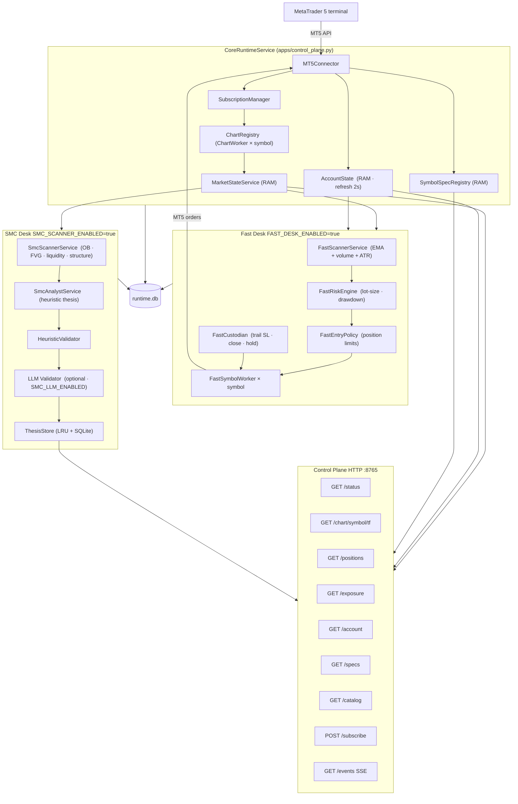

# heuristic-metatrader5-bridge

Heuristic-first MT5 trading bridge. Two independent desks share one core runtime and one HTTP control plane. No LLM in the critical path for the Fast Desk. Optional LLM validation for the SMC Desk only after heuristic filters pass. Ownership and account risk are centralized by `OwnershipRegistry` and `RiskKernel`.

---

## Quick start

```powershell
# activate venv
.\.venv\Scripts\python.exe apps/control_plane.py
```

The control plane bootstraps, prints the startup banner, and runs the full stack.  
Optional desks auto-attach via env vars — no code changes required.

```
============================================================
  Heuristic MT5 Bridge — Control Plane
============================================================
  broker   : FBS-Demo (FBS-Demo)
  account  : 105845678  10000.0 USD
  symbols  : BTCUSD, EURUSD, GBPUSD, USDJPY, USDCHF
  tf       : M5, H1, H4, D1
  smc_desk : disabled
  db       : storage/live/runtime.db
  endpoint : http://0.0.0.0:8765
============================================================
```

Every 30 seconds:
```
[2026-03-24T05:18:07Z] status=up | market=up | indicator=up | account=up | symbols=5 | positions=5 | orders=1
```

---

## Stack architecture



---

## Components

### Core runtime

| Component | Role |
|---|---|
| `MT5Connector` | Single owner of the MT5 API. All calls serialized via `_mt5_lock`. Full write surface: `send_execution_instruction`, `modify_position_levels`, `modify_order_levels`, `remove_order`, `close_position`, `find_open_position_id`. Preflight check (`_ensure_trading_available`) guards every write path. |
| `SubscriptionManager` | Manages catalog / bootstrap / subscribed symbol universes. |
| `ChartRegistry` | Spins up one `ChartWorker` per subscribed symbol. Each worker holds a RAM deque of OHLC bars per timeframe. |
| `MarketStateService` | Chart backbone. `get_candles()`, `build_chart_context()`. Indicator enrichment applied in RAM, never written to disk. |
| `SymbolSpecRegistry` | Typed MT5 specs. `pip_size(symbol)` used across all desks — not hardcoded. |
| `AccountState` | Refreshed every 2 seconds. Carries account, positions, orders, exposure. |
| `OwnershipRegistry` | Persists operation ownership (`fast_owned`, `smc_owned`, `inherited_fast`), lifecycle transitions, reassignment, and history retention. |
| `RiskKernel` | Central risk authority by broker/account with profiles `1..4`, desk allocator, effective limits, usage gates, and kill switch. |
| `BrokerSessionsService` | Session window registry from MQL5 EA. Optional. |

### Fast Desk (`src/heuristic_mt5_bridge/fast_desk/`)

No LLM. No disk I/O in the hot path. One independent worker per subscribed symbol.

| Module | Role |
|---|---|
| `context/service.py` | `FastContextService` (H1 bias + session/spread/slippage/stale/regime gates). |
| `setup/engine.py` | `FastSetupEngine` on M5 with 7 setups (`3 core + 4 patterns`). |
| `trigger/engine.py` | `FastTriggerEngine` on M1. Hard rule: no M5 setup is executed without valid M1 trigger. |
| `pending/manager.py` | Pending lifecycle (`create` by intent, `modify`, defensive `cancel`). |
| `custody/engine.py` | Professional custody (`break-even`, ATR/structural trailing, hard cut, no passive underwater, optional scale-out). Level updates must preserve the current TP unless a new TP is explicitly provided. |
| `trader/service.py` | `FastTraderService` orchestrator (`context -> setup -> trigger -> execution -> custody`) with `RiskKernel` and `OwnershipRegistry` hooks. |
| `execution/bridge.py` | Canonical connector surface only (`send_execution_instruction`, `modify_position_levels`, `modify_order_levels`, `remove_order`, `close_position`, `find_open_position_id`). |
| `workers/symbol_worker.py` | Per-symbol worker that delegates to `FastTraderService`. |
| `runtime.py` | `FastDeskService.run_forever(...)` kept as entrypoint, now wiring the layered service. |

Enable: `FAST_TRADER_ENABLED=true` (canonical) or `FAST_DESK_ENABLED=true` (legacy alias)

Fast Desk RR policy:
- `FAST_TRADER_RR_RATIO` is the single RR source of truth for the desk.
- The same value drives both TP construction and the minimum effective RR accepted by setup filtering.
- WebUI edits this same desk-wide value; Fast Desk does not expose a second independent RR floor.

### SMC Desk (`src/heuristic_mt5_bridge/smc_desk/`)

Slower prepared setups. Heuristic-first. LLM as optional final gate.

| Module | Role |
|---|---|
| `detection/` | 7 detectors: structure, OB, FVG, liquidity, fibonacci, elliott, confluences |
| `validators/heuristic.py` | Confidence filter, min-confluence threshold, pip-size-aware checks |
| `scanner/scanner.py` | `SmcScannerService` — iterates universe, runs full pipeline per symbol |
| `analyst/heuristic_analyst.py` | Builds bias, scenario, invalidations, operation candidates |
| `llm/validator.py` | Single-call LocalAI (Gemma 3 12B). Graceful fallback if disabled. |
| `state/thesis_store.py` | LRU cache (256) + SQLite. `load` / `save` / `list_symbols`. |
| `runtime.py` | `SmcDeskService` — event queue + throttled analyst dispatch |

Enable: `SMC_SCANNER_ENABLED=true` | LLM: `SMC_LLM_ENABLED=true`

### Control Plane (`apps/control_plane.py`)

FastAPI server. The **only** external interface to runtime state.

| Endpoint | Returns |
|---|---|
| `GET /status` | Full live state: health, broker identity, universes, workers, account, positions, orders |
| `GET /chart/{symbol}/{tf}` | Chart context + candle array from RAM |
| `GET /specs` / `GET /specs/{symbol}` | Symbol specifications from `SymbolSpecRegistry` |
| `GET /account` | Raw account payload (state + exposure + positions + orders) |
| `GET /positions` | `{"positions": [...], "orders": [...]}` — individual MT5 records |
| `GET /exposure` | Aggregate exposure: gross/net volume + floating P&L per symbol |
| `GET /catalog` | Broker symbol catalog |
| `POST /subscribe` | Add symbol to subscribed universe |
| `POST /unsubscribe` | Remove symbol from subscribed universe |
| `GET /api/v1/symbols/desk-assignments` | Per-symbol desk assignment map (`{symbol: ["fast","smc"]}`) |
| `PUT /api/v1/symbols/{symbol}/desks` | Set which desks process a symbol (`{"desks": ["fast","smc"]}`) |
| `GET /events?interval=1.0` | SSE stream of live state at given interval |
| `GET /ownership` | Full ownership list (`active + historical`) + summary counters |
| `GET /ownership/open` | Active ownership rows only |
| `GET /ownership/history` | Historical ownership rows (`closed` / `cancelled`) |
| `POST /ownership/reassign` | Manual operation reassignment (`fast`/`smc`) + `reevaluation_required` |
| `GET /risk/status` | Risk status: profiles, limits, allocator, usage, kill switch, recent risk events |
| `GET /risk/limits` | Effective global and desk limits |
| `GET /risk/profile` | Active profile state and overrides |
| `PUT /risk/profile` | Update profiles/overrides live |
| `POST /risk/kill-switch/trip` | Trip kill switch (blocks new entries only) |
| `POST /risk/kill-switch/reset` | Reset kill switch to armed state |

---

## Environment variables

```ini
# --- Core ---
MT5_BROKER_SERVER=FBS-Demo
MT5_ACCOUNT_LOGIN=105845678
MT5_ACCOUNT_PASSWORD=your_password
MT5_WATCH_SYMBOLS=EURUSD,GBPUSD,XAUUSD
MT5_WATCH_TIMEFRAMES=M1,M5,H1,H4,D1
MT5_POLL_SECONDS=5
CORE_ACCOUNT_REFRESH_SECONDS=2
RUNTIME_DB_PATH=storage/live/runtime.db

# --- Control Plane ---
CONTROL_PLANE_HOST=0.0.0.0
CONTROL_PLANE_PORT=8765

# --- SMC Desk ---
SMC_SCANNER_ENABLED=false
SMC_LLM_ENABLED=false
SMC_LLM_MODEL=gemma3:12b
SMC_LLM_URL=http://127.0.0.1:11434

# --- Fast Desk (legacy aliases) ---
FAST_DESK_ENABLED=false
FAST_DESK_RISK_PERCENT=1.0
FAST_DESK_MAX_POSITIONS_PER_SYMBOL=1
FAST_DESK_MAX_POSITIONS_TOTAL=4
FAST_DESK_SCAN_INTERVAL=5
FAST_DESK_CUSTODY_INTERVAL=2
FAST_DESK_SIGNAL_COOLDOWN=60

# --- Fast Trader (canonical surface) ---
FAST_TRADER_ENABLED=false
FAST_TRADER_SCAN_INTERVAL=5
FAST_TRADER_GUARD_INTERVAL=2
FAST_TRADER_SIGNAL_COOLDOWN=60
FAST_TRADER_RISK_PERCENT=1.0
FAST_TRADER_MAX_POSITIONS_PER_SYMBOL=1
FAST_TRADER_MAX_POSITIONS_TOTAL=4
FAST_TRADER_MIN_CONFIDENCE=0.60
FAST_TRADER_ATR_MULTIPLIER_SL=1.5
FAST_TRADER_RR_RATIO=3.0
FAST_TRADER_SPREAD_MAX_PIPS=3.0
FAST_TRADER_MAX_SLIPPAGE_PCT=0.05
FAST_TRADER_REQUIRE_H1_ALIGNMENT=true
FAST_TRADER_ENABLE_PENDING_ORDERS=true
FAST_TRADER_ENABLE_STRUCTURAL_TRAILING=true
FAST_TRADER_ENABLE_ATR_TRAILING=true
FAST_TRADER_ENABLE_SCALE_OUT=false
FAST_TRADER_PENDING_TTL_SECONDS=900

# --- Ownership + Risk Kernel ---
RISK_PROFILE_GLOBAL=2
RISK_PROFILE_FAST=2
RISK_PROFILE_SMC=2
RISK_MAX_DRAWDOWN_PCT=
RISK_MAX_RISK_PER_TRADE_PCT=
RISK_MAX_POSITIONS_TOTAL=
RISK_MAX_POSITIONS_PER_SYMBOL=
RISK_MAX_PENDING_ORDERS_TOTAL=
RISK_MAX_GROSS_EXPOSURE=
RISK_KILL_SWITCH_ENABLED=true
RISK_ADOPT_FOREIGN_POSITIONS=true
OWNERSHIP_HISTORY_RETENTION_DAYS=30
RISK_FAST_BUDGET_WEIGHT=1.2
RISK_SMC_BUDGET_WEIGHT=0.8
```

---

## SQLite persistence rules

All broker-dependent tables carry `(broker_server, account_login)` in the primary key.  
Stale rows are purged on broker identity change at startup.

| Table | Purpose |
|---|---|
| `symbol_catalog_cache` | Full broker symbol catalog |
| `symbol_spec_cache` | Symbol specifications |
| `account_state_cache` | Account balance, equity, margin |
| `position_cache` | Open positions |
| `order_cache` | Pending orders |
| `exposure_cache` | Gross/net exposure per symbol |
| `market_state_cache` | Candle checkpoint (recovery only — no bid/ask) |
| `smc_zones` | SMC detected zones |
| `smc_thesis_cache` | Per-symbol heuristic/LLM thesis |
| `smc_events_log` | Scanner event log |
| `fast_desk_signals` | Fast Desk signal records |
| `fast_desk_trade_log` | Fast Desk custody action log |
| `operation_ownership` | Ownership state per MT5 operation (owner, status, lifecycle, reevaluation, timestamps) |
| `operation_ownership_events` | Ownership event trail (adoption, reassignment, lifecycle transitions) |
| `risk_profile_state` | Persisted risk profiles (`global`, `fast`, `smc`) and overrides |
| `risk_budget_state` | Effective limits, allocator snapshot, usage snapshot, kill switch state |
| `risk_events_log` | Risk event history (profile changes, kill switch trip/reset, updates) |

---

## Repository structure

```
apps/
  control_plane.py       ← main entry point (full stack)
  fast_desk_runtime.py   ← standalone fast desk entry
  smc_desk_runtime.py    ← standalone SMC desk entry
src/heuristic_mt5_bridge/
  core/
    config/              ← env loader
    runtime/
      service.py         ← CoreRuntimeService
      market_state.py    ← MarketStateService
      spec_registry.py   ← SymbolSpecRegistry
  fast_desk/
    signals/             ← FastScannerService
    risk/                ← FastRiskEngine
    policies/            ← FastEntryPolicy
    custody/             ← FastCustodian
    execution/           ← FastExecutionBridge
    state/               ← FastDeskState
    workers/             ← FastSymbolWorker
    runtime.py           ← FastDeskService
  smc_desk/
    detection/           ← 7 detectors
    validators/          ← HeuristicValidator
    scanner/             ← SmcScannerService
    analyst/             ← SmcAnalystService
    llm/                 ← LLM validator
    state/               ← ThesisStore
    prompts/             ← system.md, user.md
    runtime.py           ← SmcDeskService
  infra/
    mt5/connector.py     ← MT5Connector
    storage/runtime_db.py ← SQLite CRUD
tests/
  core/                  ← 6 tests
  fast_desk/             ← 19 tests
  infra/                 ← 15 tests  (13 new: execution surface + preflight)
  smc_desk/              ← 15 tests
  integration/           ← certification harness (requires live MT5)
```

---

## Architectural constraints (non-negotiable)

- **MUST NOT** write JSON files to disk during runtime. No `core_runtime.json`, no `storage/live/*.json`.
- **MUST NOT** use hardcoded `pip_size` or `point` values. Always use `SymbolSpecRegistry`.
- **MUST NOT** call `mt5.*` directly outside `CoreRuntimeService._mt5_call()`.
- **MUST NOT** use `symbol` alone as a primary key for any broker-dependent table.
- **MUST NOT** store `bid`, `ask`, `last_price`, `tick_age_seconds`, or `feed_status` in SQLite.
- **MUST** expose all runtime state via the Control Plane HTTP — no disk transport bus.
- **MUST** normalize all timestamps to UTC0 before any storage.
- **MUST** partition every SQLite table by `(broker_server, account_login)`.

## What this repo is not

- Not a copy of the `llm-metatrader5-bridge` office stack
- Not a `chairman → analyst → supervisor → trader → risk` pipeline
- Not a system where disk is the runtime data bus


## Core decision

The fast desk must not wait for multi-role LLM coordination.

Priority order:

1. protect account
2. protect open profit
3. cut losses fast
4. execute deterministically
5. explain later

## Implementation rules — MUST / MUST NOT

These rules are non-negotiable. Any implementation that violates them is incorrect by definition.

### MUST NOT

- **MUST NOT** write any JSON file to disk during runtime operation. No `core_runtime.json`. No `storage/live/*.json`. No market snapshot files. If external observability is needed, that is the Control Plane HTTP responsibility.
- **MUST NOT** write indicator snapshots to local disk. Indicators are applied directly to `MarketStateService` in RAM and discarded.
- **MUST NOT** store `bid`, `ask`, `last_price`, `tick_age_seconds`, `bar_age_seconds`, or `feed_status` as columns in any SQLite table. These are dynamic feed data, not operational recovery data.
- **MUST NOT** use hardcoded heuristics for `pip_size`, `point`, or any symbol specification. All symbol specs must come from the `SymbolSpecRegistry` loaded from the MT5 connector at startup.
- **MUST NOT** have any component (WebUI, Fast Desk, SMC Desk) read market state from disk. All consumption is via RAM reference or Control Plane HTTP.
- **MUST NOT** create a periodic "live publish" loop that writes to disk. The variable `CORE_LIVE_PUBLISH_SECONDS` must not exist.
- **MUST NOT** use `symbol` alone as the primary key in any SQLite table that stores broker-dependent data. All such tables must include `broker_server` and `account_login` in the primary key.

### MUST

- **MUST** expose runtime state exclusively via the Control Plane HTTP server. Minimum endpoint: `GET /status`.
- **MUST** normalize all internal timestamps to UTC0 before storing in RAM or SQLite. The `server_time_offset_seconds` is applied at normalization time only; it is never propagated as a stored field.
- **MUST** partition every SQLite table containing symbol, account, or market data by `(broker_server, account_login)`.
- **MUST** purge stale broker data from SQLite when `broker_identity` changes from the previous session.
- **MUST** expose the Control Plane on `CONTROL_PLANE_HOST` (default `0.0.0.0`) and `CONTROL_PLANE_PORT` (default `8765`).
- **MUST** treat multi-broker operation as a base case. The system supports N parallel MT5 instances (different brokers, demo and real) without data cross-contamination.
- **MUST** support polling frequency from seconds down to tick level without architectural changes.

## Memory policy

- the `Fast Desk` relies on a translated **heuristic library** and explicit runtime state
- the `SMC Desk` may keep slower analytical state where justified
- persistent storage exists only for: symbol catalog, symbol specs, account state, positions, orders, execution events
- dynamic market data (prices, charts, indicators) lives in RAM only

## High-level architecture

```text
MT5 terminal(s) + broker services
  -> ConnectorIngress (single owner of MT5 API)
      -> SubscriptionManager
      -> ChartWorker[symbol] × N   (RAM deque per timeframe)
      -> MarketStateService        (RAM chart backbone)
      -> SymbolSpecRegistry        (RAM specs)
      -> AccountState              (RAM)
      -> BrokerSessionsService     (RAM registry)
      -> IndicatorBridge           (RAM apply-only)
  -> CoreRuntimeService
      -> Control Plane HTTP        (FastAPI, 0.0.0.0)
          -> WebUI                 (any web framework)
          -> Fast Desk Runtime
          -> SMC Desk Runtime
```

### Shared Core

- MT5 connector (single owner, `asyncio.to_thread` wrapper)
- `SubscriptionManager`: catalog / bootstrap / subscribed universes
- `ConnectorIngress`: fans out MT5 polls to symbol workers only
- `ChartWorker[symbol]`: RAM deque of candles per timeframe
- `MarketStateService`: chart backbone, indicator enrichment
- `SymbolSpecRegistry`: typed specs from MT5, broker/account partitioned
- account runtime, broker sessions service
- SQLite persistence (catalog, specs, positions, orders, execution)
- execution bridge

### Fast Desk

- signal engine (pure heuristics, no LLM)
- risk engine
- execution custodian
- event-driven workers per symbol and per position
- consumes chart state from RAM / Control Plane — never from disk

### SMC Desk

- SMC scanner, heuristic analyst, heuristic validators
- optional multimodal LLM validator (after heuristic filters pass)
- separate queue, separate from fast desk

### Control Plane

- FastAPI server, `0.0.0.0:CONTROL_PLANE_PORT`
- exposes: status, charts, specs, account, positions, catalog
- subscribe / unsubscribe endpoints (ready for WebUI)
- SSE stream for live chart updates

## What this repo is not

- Not a copy of the LLM office stack
- Not a continuation of `chairman -> analyst -> supervisor -> trader -> risk` for scalping
- Not a system where disk is a runtime transport bus

## Canonical reference documents

Before writing any code, read in order:

1. `docs/ARCHITECTURE.md`
2. `docs/plans/2026-03-23_mt5_data_ownership_boundary.md`
3. `docs/plans/2026-03-23_chart_ram_runtime_architecture.md`
4. `docs/plans/2026-03-23_core_runtime_subscription_refactor_plan.md`
5. `docs/plans/2026-03-23_correction_action_plan.md`
6. `docs/audit/2026-03-23_full_audit.md`


