# Architecture

> **Status**: implemented and tested — March 2026
> **Connector execution surface**: closed 2026-03-24 — all 5 missing public methods added and certified
> **Ownership + Risk kernel**: phase closure delivered 2026-03-24 (`OwnershipRegistry`, auto-adoption, `RiskKernel`, API endpoints)
> **Bootstrap conformance audit**: delivered 2026-03-25 — 4 bugs identified and repaired (RiskKernel async, MT5 lock serialization, hot-path disk I/O, sessions default)
> **Fast Desk analysis audit**: delivered 2026-03-26 — 8 strategic gates added (RR, OB mitigation, premium/discount, market phase, exhaustion, EMA, BOS impulse, directional concentration)
> **Slippage model**: corrected 2026-03-26 — percentage-based context gate + spec-driven execution slippage (replaces hardcoded point threshold)
> **Fast Desk 6-phase refactoring**: delivered 2026-03-28 — H1→M30 normalization, hard/soft gate split, ATR-aware EMA, M5-only market phase, setup/trigger engine fixes
> **Broker clock architecture**: delivered 2026-03-28 — EA sends `TimeTradeServer()`/`TimeGMTOffset()`, gate uses system UTC + EA GMT offset, tick offset demoted to informative

> **SMC LLM pipeline audit**: delivered 2026-04-02 — sequential dispatch (no concurrent GPU saturation), `_LLM_GATE` lock, config wiring fix, prompt cache, operational logging
> **SMC Trader activation**: delivered 2026-04-03 — 6 new modules (config, entry_policy, pending, service, custody, worker), risk-based lot sizing via `FastRiskEngine`, RiskKernel profile integration, WebUI toggle, dynamic reconciliation loop
> **Correlation engine**: delivered 2026-04-05 — `CorrelationService` computing Pearson matrices per timeframe (M5/M30/H1), `FastCorrelationPolicy` for implicit hedge + inverse concentration detection, `SmcCorrelationFormatter` for LLM context enrichment, WebUI heatmap with stale source visibility; all 5 runtime wiring changes complete; 203 tests passing
> **FAST/SMC ticket isolation**: delivered 2026-04-07 — `account_payload_for_desk()` filters the global MT5 snapshot per desk before any desk logic runs; FAST blacklist (`smc_pos_ids`/`smc_order_ids`) removed and replaced with positive allowlist (`fast_owned` + `inherited_fast`); desk-scoped control plane endpoints `/api/v1/fast/operations` and `/api/v1/smc/operations`; WebUI Fast Desk and SMC Desk consume desk-scoped stores; 16 new isolation tests; 44 regression tests passing

---

## Purpose

Two trading desks with incompatible latency requirements share one MT5 connection,
one market-state RAM backbone, and one HTTP control plane.

| Desk | Latency target | LLM | Entry |
|------|---------------|-----|-------|
| **Fast Desk** | seconds | never | `FAST_TRADER_ENABLED=true` (alias: `FAST_DESK_ENABLED=true`) |
| **SMC Desk** | minutes | optional, after heuristics | `SMC_SCANNER_ENABLED=true` + `SMC_TRADER_ENABLED=true` |

**The closer logic is to execution, the less it may depend on LLM, disk, or network.**

---

## FastTraderService v1 (Immediate Phase)

Fast execution now runs through `FastTraderService` with explicit layered contracts on `M1 + M5 + M30`:

1. `FastContextService` builds M30 bias and hard gates (`session`, `spread`, `slippage`, `stale_feed`, `session_blocked`, regime, `market_phase`, `exhaustion_risk`, `ema_overextended`).
2. `FastSetupEngine` detects M5 setups (`3 core + 4 patterns`) with structural filters:
   - **Spread-aware SL**: widens SL by live spread distance before RR calculation.
   - **Minimum RR gate**: rejects setups with effective RR < `FAST_TRADER_MIN_RR` (default 2.0).
   - **OB mitigation filter**: skips order blocks where price already closed inside the zone.
   - **Premium/Discount filter**: buy only in discount zone, sell only in premium zone (H1 impulse reference).
   - **BOS impulse validation**: breakout-retest requires BOS candle body ≥ 1.2× average M5 body (reject weak/fake breakouts).
3. `FastTriggerEngine` confirms with M1 trigger (`micro_bos`, `micro_choch`, `rejection_candle`, `reclaim`, `displacement`).
4. Hard rule: no M5 setup can execute without a valid M1 trigger.
5. Entry routing: retests prefer `pending`; reclaim/displacement prefer `market`.
6. `FastPendingManager` controls pending lifecycle (`modify_order_levels` / `remove_order`).
7. `FastCustodyEngine` applies professional custody (break-even, ATR trailing, structural trailing, hard cut, no passive underwater, optional scale-out).
8. Custody scope is restricted to `fast_owned` and `inherited_fast`. FAST never sees, enumerates, or manages SMC-owned tickets — the broker snapshot is pre-filtered by `account_payload_for_desk(desk="fast")` before any desk logic runs. The custody loop asserts this contract and logs a warning if an unexpected non-FAST row appears in `ownership_open_ref`.
9. Runtime integration uses `RiskKernel` and `OwnershipRegistry` as authorities through `CoreRuntimeService` hooks.

### Context gates (v0.3.4)

| Gate | Type | Logic |
|------|------|-------|
| Session | hard | Only trade during configured sessions (default: London, overlap, NY) |
| Session blocked | hard | Broker trade session closed (from EA schedule + system UTC + EA GMT offset) |
| Spread | hard | Percentage-based per asset class (forex/crypto/metals/indices), 3 tolerance levels |
| Slippage | hard | `abs(tick - last_M1_close) / tick_price × 100 > max_slippage_pct` — universal, no symbol-specific hardcoding |
| Stale feed | hard | Block if last M1 candle is older than `stale_feed_seconds` |
| Market phase | hard | `m5_ranging` blocks trading — detected from M5 structure contraction |
| EMA overextension | hard | Price > `max(2%, 0.5×ATR/price×100)` from EMA20 on M30 → chasing, blocked (ATR-adaptive) |
| Volatility regime | hard | `very_low` M30 volatility → `no_trade_regime` |
| Exhaustion risk | soft | `high` exhaustion + setup confidence < 0.80 → skip setup (not a hard context block) |

### Execution slippage (spec-driven)

Execution `max_slippage_points` sent to MT5 is derived per-symbol from the broker's symbol specification:
- Primary: `10% of trade_stops_level` (clamped to `[5, stops_level]`)
- Fallback: `3 × typical spread` (from symbol spec)
- Ultimate fallback: `30 points` (for unknown specs only)

No global hardcoded slippage value is used.

### Entry policy gates

| Gate | Logic |
|------|-------|
| Duplicate prevention | Same symbol + same side already open → block |
| Max positions | Total open ≥ `max_positions_total` → block |
| Directional concentration | ≥ 70% of open positions (min 3) on same side → block new entries in that direction |

---

## Correlation Engine

Optional component. Enabled via `CORRELATION_ENABLED=true`. Pure RAM — no disk writes.

### Architecture

```
MarketStateService.get_candles(symbol, tf)
        │
        ▼
CorrelationService (background loop, every CORRELATION_REFRESH_SECONDS = 60s)
        │  aligner.align_and_returns()   → inner join by epoch, simple/log returns
        │  _pearson()                    → clamped [-1, 1], None on insufficient data
        │  CorrelationMatrixSnapshot     → RAM cache, atomic replace
        ▼
┌───────────────────────────────────────────────────────────────────┐
│                      Public API                                   │
│  get_matrix(tf)                → full N×N snapshot               │
│  get_pair(a, b, tf)            → CorrelationPairValue             │
│  get_exposure_relations(s, tf) → pairs where s is involved        │
│  active_symbols()              → current symbol universe          │
└───────────────────────────────────────────────────────────────────┘
        │                         │
        ▼                         ▼
Fast Desk                    SMC Desk
FastCorrelationPolicy        SmcCorrelationFormatter
(timeframe M5)               (timeframe H1, top_n=5)
        │                         │
        ▼                         ▼
FastContext.details           analyst_input
  ["correlation"]             ["correlation_context"]
FastContext.warnings          + LLM system prompt snippet
  ["correlation_conflict:…"]
```

### Staleness policy

`source_stale=True` is set on any pair where either symbol's last candle is older than `CORRELATION_STALE_SOURCE_SECONDS` (default 300 s). Stale pairs are still returned; the caller decides whether to suppress or display with a warning. The WebUI heatmap shows an amber banner and `~` prefix on stale cells.

### Fast Desk — `FastCorrelationPolicy`

Two risk detectors applied at entry time on `FastContextService.build_context()`:

| Detector | Condition | Action |
|---|---|---|
| Implicit hedge | Open position on symbol_B with **opposite** side, `corr(A,B) > 0.80` | Block entry, add `correlation_conflict:implicit_hedge` warning |
| Inverse concentration | Open position on symbol_B with **same** side, `corr(A,B) < −0.80` | Block entry, add `correlation_conflict:inverse_concentration` warning |

### SMC Desk — `SmcCorrelationFormatter`

Injects correlation context into the analyst pipeline. `build_context_dict(symbol)` returns a structured dict for the Python analyst layer. `build_context_snippet(symbol)` returns plain text for the LLM system message. Both select `top_n=5` pairs by absolute correlation magnitude.

### Runtime wiring

`CORRELATION_ENABLED=true` → `CoreRuntimeService.correlation_service` is created → passed via `correlation_service=` kwargs to `create_fast_desk_service()` and `create_smc_desk_service()` → each factory instantiates its desk-specific wrapper → flows down to `FastContextService` (Fast Desk) and `run_smc_heuristic_analyst()` (SMC Desk) via existing optional parameters.

`CORRELATION_ENABLED=false` (default) → all references stay `None` → zero runtime cost, all downstream code is a no-op.

Preflight source print bundle (canonical reading evidence):

- `docs/fast_trader/results/2026-03-24_fast_trader_print_bundle/print_manifest.json`
- `docs/fast_trader/results/2026-03-24_fast_trader_print_bundle/print_index.md`

---

## Full system diagram

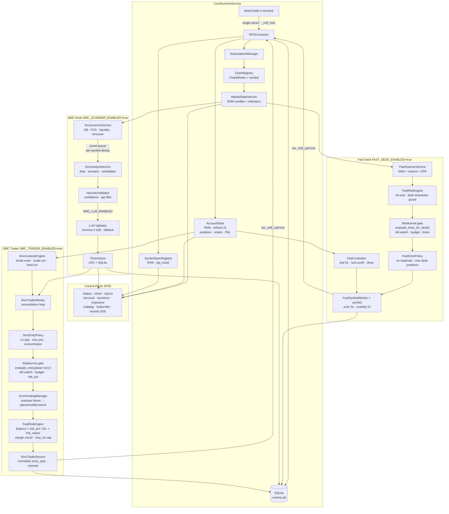

---

## Data bus rules

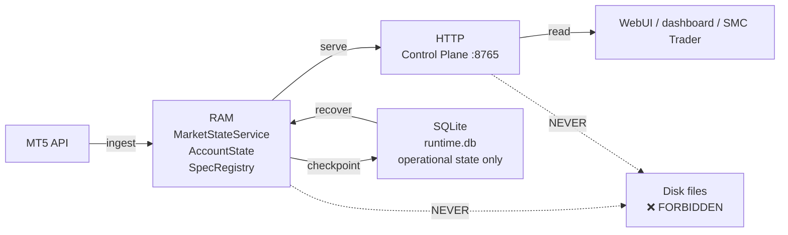

**Allowed data paths:**
- MT5 API → RAM → HTTP → consumer
- RAM → SQLite (operational persistence only)
- SQLite → RAM (recovery at startup only)

**Forbidden:**
- Any component writing JSON/CSV/pickle to disk during runtime
- Any component reading market state from disk during steady-state operation
- Any direct `mt5.*` call outside `CoreRuntimeService._mt5_call()`

---

## CoreRuntimeService: data lifecycle

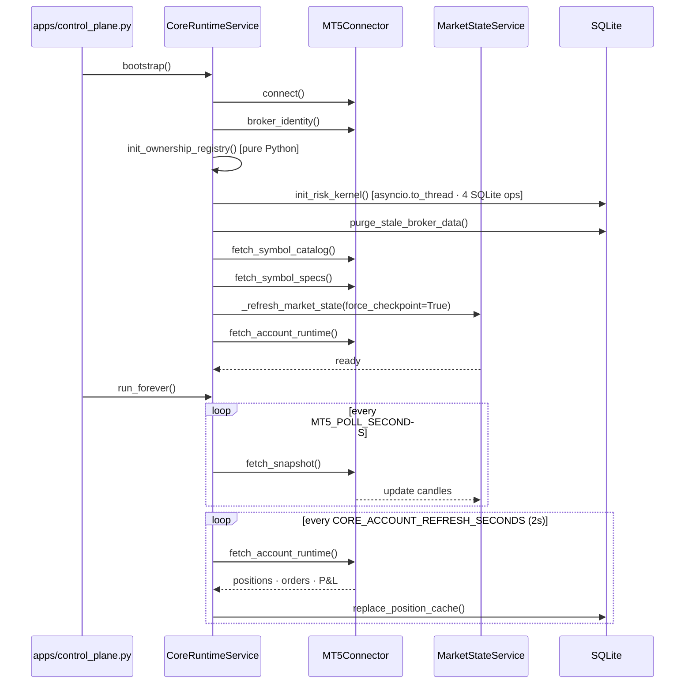

---

## Fast Desk: per-symbol cycle

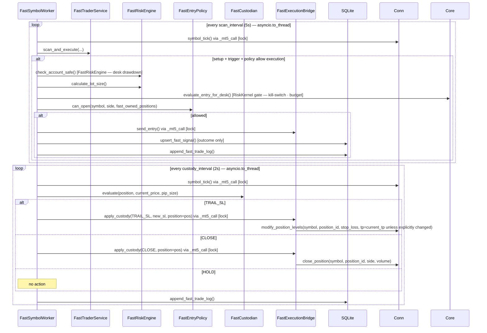

### Custody rules (deterministic, no LLM)

| Condition | Action |
|-----------|--------|
| floating profit ≥ 2 × risk_distance_pips | `TRAIL_SL` — move SL to breakeven + 1 pip |
| floating profit ≥ 3 × risk_distance_pips | `TRAIL_SL` — lock 50% of profit |
| floating loss > 1.2 × risk_distance_pips | `CLOSE` — slippage exceeded |
| otherwise | `HOLD` |

### Fast Desk RR contract

- Fast Desk uses a single desk-wide RR value.
- `FAST_TRADER_RR_RATIO` is the operator-facing setting from `.env` and WebUI.
- The setup layer syncs its effective `min_rr` to that same value to avoid conflicting RR thresholds inside the same desk.
- Custody level modifications must preserve the current TP when only the SL is being adjusted.

---

## SMC Desk: event-driven pipeline

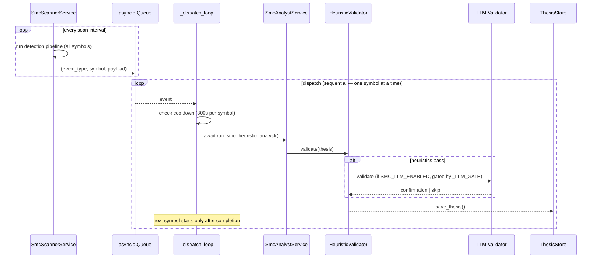

> **Concurrency policy (v0.3.5)**: dispatch processes one symbol at a time (`await` instead of `create_task`). The LLM validator holds an `asyncio.Lock` (`_LLM_GATE`) so at most one HTTP call to LocalAI is in flight. This prevents GPU saturation on single-GPU setups running LocalAI with large models (Gemma 3 12B).

### SMC detection pipeline

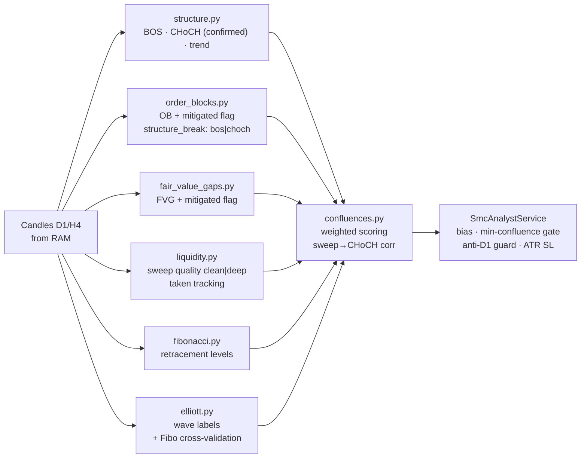

#### Detection fields added (v0.3.0 audit)

| Module | New fields | Purpose |
|--------|-----------|----------|
| `structure.py` | `last_choch.confirmed` | True when follow-through BOS confirms CHoCH |
| `order_blocks.py` | `mitigated`, `structure_break` | Zone lifecycle + BOS vs CHoCH origin |
| `fair_value_gaps.py` | `mitigated` | Zone lifecycle tracking |
| `liquidity.py` | `sweep_quality`, `taken` | Sweep classification + spent zone tracking |
| `confluences.py` | weighted scoring, `sweep_choch_corr`, `ob_unmitigated`, `fvg_unmitigated`, `choch_confirmed` | Conviction-based quality score |
| `elliott.py` | Fibo retrace validation | W2/W4 depth + W3 extension checks |

---

## Control Plane endpoints

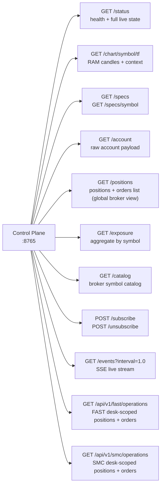

Ownership and risk operational surface (same control plane, no extra external interface):

- `GET /ownership`
- `GET /ownership/open`
- `GET /ownership/history`
- `POST /ownership/reassign`
- `GET /risk/status`
- `GET /risk/limits`
- `GET /risk/profile`
- `PUT /risk/profile`
- `POST /risk/kill-switch/trip`
- `POST /risk/kill-switch/reset`

---

## SQLite schema (current tables)

All tables with broker-dependent data carry `(broker_server, account_login)` in their primary key.

```mermaid
erDiagram
    symbol_catalog_cache {
        TEXT broker_server PK
        INTEGER account_login PK
        TEXT symbol PK
        TEXT raw_json
        TEXT updated_at
    }
    symbol_spec_cache {
        TEXT broker_server PK
        INTEGER account_login PK
        TEXT symbol PK
        REAL pip_size
        TEXT raw_json
        TEXT updated_at
    }
    account_state_cache {
        TEXT broker_server PK
        INTEGER account_login PK
        TEXT raw_json
        TEXT updated_at
    }
    position_cache {
        TEXT broker_server PK
        INTEGER account_login PK
        INTEGER position_id PK
        TEXT raw_json
        TEXT updated_at
    }
    order_cache {
        TEXT broker_server PK
        INTEGER account_login PK
        INTEGER order_id PK
        TEXT raw_json
        TEXT updated_at
    }
    smc_zones {
        TEXT broker_server PK
        INTEGER account_login PK
        TEXT zone_id PK
        TEXT symbol
        TEXT evidence_json
        TEXT created_at
    }
    smc_thesis_cache {
        TEXT broker_server PK
        INTEGER account_login PK
        TEXT symbol PK
        TEXT thesis_json
        TEXT updated_at
    }
    smc_events_log {
        TEXT broker_server PK
        INTEGER account_login PK
        TEXT event_id PK
        TEXT symbol
        TEXT event_type
        TEXT logged_at
    }
    fast_desk_signals {
        TEXT broker_server PK
        INTEGER account_login PK
        TEXT signal_id PK
        TEXT symbol
        TEXT side
        TEXT trigger
        REAL confidence
        TEXT generated_at
    }
    fast_desk_trade_log {
        TEXT broker_server PK
        INTEGER account_login PK
        TEXT log_id PK
        TEXT symbol
        TEXT action
        INTEGER position_id
        TEXT logged_at
    }
```

Additional operational tables introduced for ownership/risk closure:

- `operation_ownership`
- `operation_ownership_events`
- `risk_profile_state`
- `risk_budget_state`
- `risk_events_log`

Table for SMC trader execution audit (introduced in Step 4):

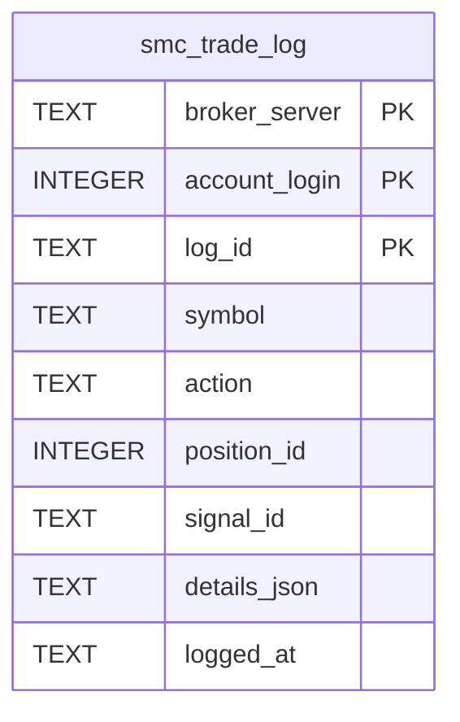

---

## Multi-broker model

The system is designed for N parallel MT5 instances from day one.

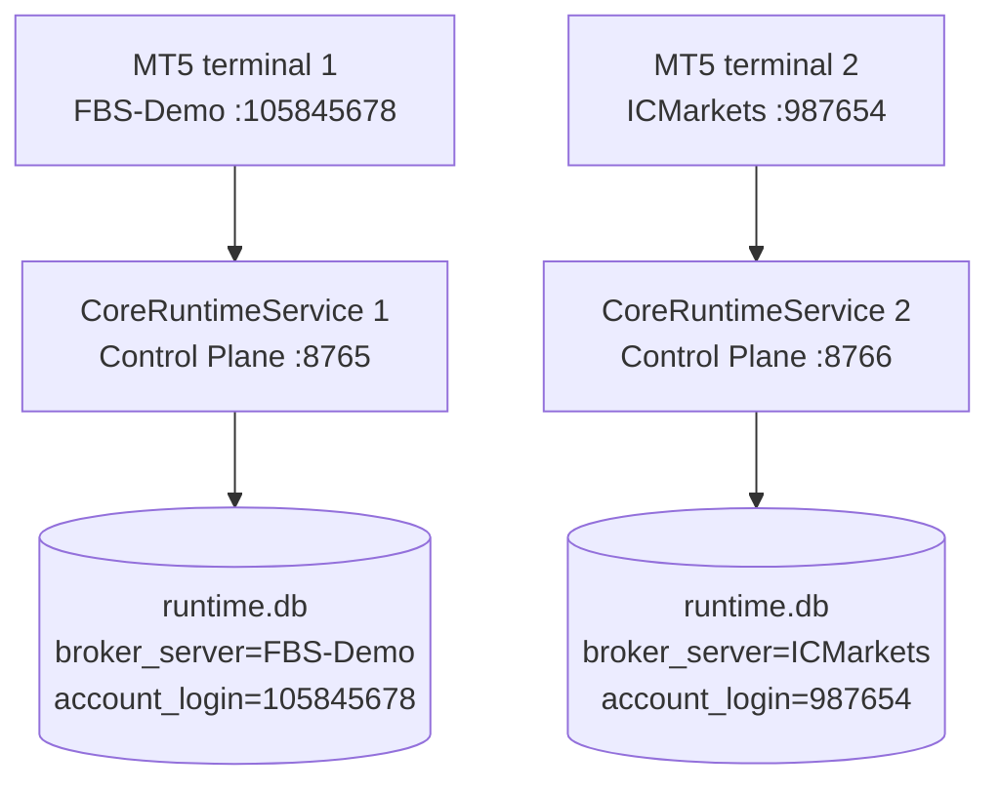

Each instance has its own SQLite partition. Data never crosses between brokers.

---

## MT5Connector public execution surface

All write paths check `_ensure_trading_available()` before calling `order_send`.

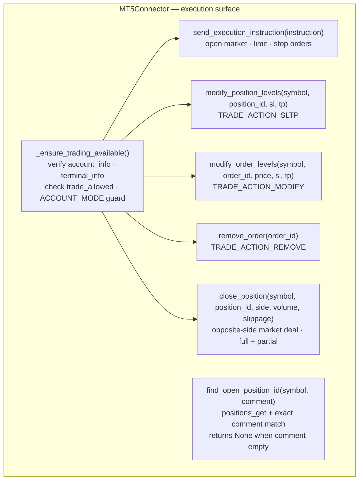

### Preflight contract

Before every write action the connector verifies:

1. `mt5.account_info()` is not `None`
2. `mt5.terminal_info()` is not `None`
3. `terminal_info().trade_allowed` is `True`
4. `ACCOUNT_MODE` guard — if `ACCOUNT_MODE=demo`, real-account connections are blocked

Failure raises `MT5ConnectorError` with actionable text.

> **Note**: `probe_account()` is intentionally NOT called inside preflight. Certification
> confirmed that a failed `probe_account()` can degrade the terminal session and disable
> `AutoTrading`. All write methods are independent of account-probe side effects.

### Known comment limitation

Certification on the current broker confirmed:
- Execution with `comment=""` succeeds.
- Execution with a populated `comment` may be rejected (`Invalid "comment" argument`).
- All write methods allow empty comment and never require a non-empty one.
- `find_open_position_id()` works when comments are populated, but returns `None` when
  comment is empty — it never raises on comment-not-found.

---

## What must never enter the codebase

| Pattern | Reason |
|---------|--------|
| `core_runtime.json` or any live JSON written to disk | disk is not the data bus |
| `CORE_LIVE_PUBLISH_SECONDS` loop | same |
| `pip_size_for_symbol()` or hardcoded pip values | must use `SymbolSpecRegistry` |
| `bid`, `ask`, `last_price` in any SQLite column | volatile — RAM only |
| `symbol` alone as PK for broker-dependent tables | broker partitioning required |
| `mt5.*` calls outside `_mt5_call` serializer | MT5 API is not thread-safe |
| Office-style roles (chairman, analyst-supervisor, memory_curator) in Fast Desk | latency budget exceeded |
| Hardcoded `max_slippage_points` for all symbols | must derive from symbol spec (`trade_stops_level`, `spread`) |
| Fixed-point thresholds for cross-asset-class comparisons | must use percentage or spec-normalized values |


- `Fast Desk`: scalping / fast intraday execution and custody — heuristic only, no LLM
- `SMC Desk`: slower prepared setups, deeper context, optional LLM reasoning
- `Shared Core`: all operational infrastructure shared by both desks
- `Control Plane`: HTTP server — the only external interface to runtime state

The old repository proved that these two workloads cannot be orchestrated through the same role stack.

## Architectural principle

The closer the logic is to execution time, the less it should depend on LLM, disk, or external services.

```text
Fast Desk: no LLM, no disk I/O in hot path
SMC Desk:  LLM allowed, but only after heuristic filters pass
```

## Top-level design

```text
MT5 terminal(s)
  -> ConnectorIngress  (single MT5 API owner)
      -> SubscriptionManager
      -> ChartWorker[symbol] × N   ← RAM only
      -> MarketStateService        ← RAM only
      -> SymbolSpecRegistry        ← RAM only
      -> AccountState              ← RAM + SQLite
      -> BrokerSessionsService     ← RAM only
      -> IndicatorBridge           ← RAM apply-only
  -> CoreRuntimeService
      -> Control Plane HTTP  (FastAPI, 0.0.0.0:8765)
          -> WebUI           (any web framework, consumes HTTP/SSE)
          -> Fast Desk Runtime
          -> SMC Desk Runtime
```

---

## Ticket isolation: FAST vs SMC

### Principle

Both desks share one MT5 connection and one `OwnershipRegistry`, but they operate on strictly disjoint ticket sets. The isolation is implemented as **positive allowlist, not blacklist**: each desk receives only the positions and orders it owns before any desk logic runs.

### Ticket ownership taxonomy

| `ownership_status` | `desk_owner` | Meaning |
|---|---|---|
| `fast_owned` | `fast` | Position or order placed by the FAST desk |
| `smc_owned` | `smc` | Position or order placed by the SMC desk |
| `inherited_fast` | `fast` | External/manual ticket adopted by FAST (e.g. human-opened position) |
| `unassigned` | `unassigned` | Unknown — pending first reconciliation cycle |

> `inherited_fast` means external to the stack (opened manually by a human trader). SMC tickets are **never** classified as `inherited_fast` — they have their own `smc_owned` row.

### Isolation flow

```text
MT5 broker snapshot (global: all positions + orders)
        │
        ▼
ownership_registry.reconcile_from_caches()
  ← labels every ticket: fast_owned / smc_owned / inherited_fast
        │
        ├─► account_payload_for_desk(desk="fast")
        │     filter: desk_owner=="fast" OR ownership_status in {"fast_owned","inherited_fast"}
        │     result: only FAST tickets visible
        │
        └─► account_payload_for_desk(desk="smc")
              filter: desk_owner=="smc" OR ownership_status=="smc_owned"
              result: only SMC tickets visible
                │                     │
                ▼                     ▼
        FastTraderService       SmcDeskService
        run_custody()           run_smc_scan()
```

FAST custody adds a second-layer contract defence: if `ownership_open_ref` returns a row where `desk_owner != "fast"`, it logs a WARNING and skips the row without managing the position. This guards against upstream misconfiguration but must never trigger in normal operation.

### OwnershipRegistry guards

| Transition | Behaviour |
|---|---|
| Unknown ticket appears in MT5 snapshot | `reconcile_from_caches` adopts as `inherited_fast` (if `auto_adopt_foreign=True`) |
| SMC ticket reappears in reconcile after being known | Row found by `get_by_position_id` → no reclassification |
| `reassign(smc → fast)` called | `ValueError("reassigning from smc to fast is not allowed")` — hard block |
| `account_payload_for_desk(desk="fast")` called without `ownership_registry` | Falls back to global payload (safe degraded mode at startup) |

### Environment variables

| Variable | Canonical | Legacy alias | Default |
|---|---|---|---|
| Auto-adopt external tickets | `RISK_ADOPT_FOREIGN_POSITIONS` | `OWNERSHIP_AUTO_ADOPT_FOREIGN` | `true` |

Both names are accepted; the canonical name takes precedence; the alias is a fallback for existing `.env` files.

### Desk-scoped WebUI endpoints

| Endpoint | Payload |
|---|---|
| `GET /api/v1/fast/operations` | `{positions, orders, updated_at}` — FAST-visible only |
| `GET /api/v1/smc/operations` | `{positions, orders, updated_at}` — SMC-visible only |
| `GET /positions` | Global broker view — for audit consoles only |

Fast Desk (`apps/webui/src/routes/FastDesk.tsx`) polls `/api/v1/fast/operations` via `fastOperationsStore`. SMC Desk polls `/api/v1/smc/operations` via `smcOperationsStore`. Neither route reads from the global `operationsStore` for position data.

---

## Ownership and data boundaries

### What MUST live in RAM only

| Data domain | Owner | Reason |
|---|---|---|
| OHLC chart candles (deque) | `ChartWorker[symbol]` | Hot path, tick-level update frequency |
| Current bid / ask / spread | `ChartWorker[symbol]` | Changes multiple times per second |
| Feed status (tick age, bar age) | `ChartWorker[symbol]` | Volatile, meaningless as persisted value |
| Indicator enrichment (applied) | `MarketStateService` | Applied to chart in RAM, no disk copy |
| Symbol specs (typed) | `SymbolSpecRegistry` | Loaded at startup, accessed every signal cycle |
| Broker session windows | `BrokerSessionsService.registry` | Live state, refreshed by MQL5 EA every 60s. Includes `TimeTradeServer()`/`TimeGMTOffset()` for authoritative broker clock. |
| Chart context (built view) | `MarketStateService` | Derived on demand from RAM candles |

### What is allowed in SQLite (operational persistence only)

| Data domain | Table | Notes |
|---|---|---|
| Full broker symbol catalog | `symbol_catalog_cache` | Partitioned by `(broker_server, account_login)` |
| Symbol specifications | `symbol_spec_cache` | Partitioned by `(broker_server, account_login, symbol)` |
| Account state | `account_state_cache` | Recovery only |
| Open positions | `position_cache` | Recovery only |
| Pending orders | `order_cache` | Recovery only |
| Exposure state | `exposure_cache` | Recovery only |
| Execution events | `execution_event_cache` | Audit trail |
| Market state checkpoint | `market_state_cache` | Candle structure only — NO `bid`/`ask`/`tick_age` |

### What MUST NOT exist anywhere on disk

- `storage/live/core_runtime.json` — must not exist
- `storage/live/` — directory must not exist
- `storage/indicator_snapshots/*.json` — must not exist
- Any file containing `bid`, `ask`, or live prices written during runtime
- Any SQLite column named `bid`, `ask`, `last_price`, `tick_age_seconds`, `bar_age_seconds`, `feed_status`

---

## Shared Core

### Responsibilities

- connect to MetaTrader5 (single owner: `ConnectorIngress`)
- maintain `SubscriptionManager` (catalog / bootstrap / subscribed universes)
- keep chart state in RAM via `ChartWorker` + `MarketStateService`
- normalize all timestamps to UTC0 before storage
- maintain broker session awareness via `BrokerSessionsService` (trade/quote windows + GMT offset from EA)
- enrich indicators into RAM via `IndicatorBridge` (file-in, RAM-out)
- persist operationally necessary data to SQLite (partitioned by broker/account)
- expose account / positions / orders
- execute orders against MT5 via `ExecutionBridge`
- expose runtime state via Control Plane HTTP

### Key constraint: single MT5 API owner

```text
CORRECT:
  ConnectorIngress → fans out updates to ChartWorker[symbol] × N

FORBIDDEN:
  ChartWorker[symbol] → calls mt5.copy_rates_from_pos() directly
  AccountRefresher    → calls mt5.account_info() while ConnectorIngress is also running
```

The `MT5Connector` must be accessed only through the `_mt5_lock` / `_mt5_call` serializer in `CoreRuntimeService`.

### Multi-broker model

The system is designed from the ground up for N parallel MT5 instances:
- one `CoreRuntimeService` per MT5 terminal
- each with its own `ConnectorIngress`, `ChartRegistry`, `SpecRegistry`
- each with its own SQLite partition (`broker_server` + `account_login`)
- each with its own Control Plane HTTP port (or a multi-instance router)
- data from different brokers never shares a RAM structure or SQLite table row

### UTC0 normalization rule

The broker server operates in its own timezone (e.g. UTC+2 for FBS, EET). This offset is measured at startup:
- `server_time_offset_seconds` is applied **once** during ingestion to produce UTC0 timestamps
- all internal timestamps, SQLite records, and chart candles are in UTC0
- `server_time_offset_seconds` is NOT stored as a chart field or propagated downstream

---

## Fast Desk

### Goal

React in very low latency to market conditions using deterministic heuristics only.

### Critical-path pipeline

```text
ChartWorker[symbol] RAM update
  -> fast_signal_engine   (deterministic heuristics)
  -> fast_risk_engine     (account limits, position checks)
  -> fast_execution_custodian
  -> ExecutionBridge      (MT5 order)
```

### Rules

- no LLM anywhere in the hot path
- no disk I/O in signal or custody cycle
- no blocking HTTP calls in signal cycle
- no memory curator role
- consumes chart state from RAM reference or Control Plane HTTP — never from any file

### Worker model

- one signal worker per subscribed symbol
- one custody worker per open position
- one account guard worker
- one execution worker

### Heuristic library

The Fast Desk replaces prompt-era domain knowledge with:
- deterministic heuristics (typed Python functions)
- explicit validators
- typed risk policies
- explicit runtime state per symbol and per position

### Performance target

- deterministic cycle: milliseconds to low seconds
- no LLM slots in the path
- no disk latency in the path

---

## SMC Desk

### Goal

Execute prepared setups using heuristics first, with optional LLM validation as a final gate.

### SMC pipeline

```text
MarketStateService RAM
  -> smc_heuristic_scanner       (detects zones, mitigation lifecycle, sweep events)
  -> smc_heuristic_analyst        (weighted confluences, min-2 gate, anti-D1 guard, ATR SL)
  -> smc_heuristic_validators     (confidence & pip filters)
  -> optional multimodal LLM validator  (only if heuristics pass)
  -> smc_thesis
  -> smc_trader  (SMC_TRADER_ENABLED=true)
```

### SMC Trader execution pipeline (v0.3.5)

```mermaid
sequenceDiagram
    participant Loop as Reconciliation Loop
    participant Worker as SmcTraderWorker
    participant Policy as SmcEntryPolicy
    participant RK as RiskKernel
    participant PM as SmcPendingManager
    participant Risk as FastRiskEngine
    participant Exec as FastExecutionBridge
    participant MT5 as MT5Connector

    loop every custody_interval_seconds (30s)
        Loop->>Worker: process each watched symbol
        Worker->>Worker: load thesis from ThesisStore
        Worker->>Worker: get price via get_candles("M1", 1)
        Worker->>Policy: can_open(symbol, side, owned_ops)
        alt blocked by policy
            Policy-->>Worker: (False, reason)
        else allowed
            Worker->>RK: evaluate_entry(desk="smc", symbol)
            RK-->>Worker: {allowed, risk_per_trade_pct}
            Worker->>PM: evaluate_new_thesis(thesis, price, pip_size)
            PM-->>Worker: SmcPendingDecision(action="place")
            Worker->>Risk: calculate_lot_size(balance, risk_pct, sl_pips, spec, account)
            Risk-->>Worker: volume (risk-sized)
            Worker->>Exec: send_entry(limit/stop, volume, SL, TP)
            Exec->>MT5: order_send() via _mt5_call lock
        end
    end
```

#### Lot sizing formula

```
risk_amount  = balance × risk_per_trade_pct / 100
sl_points    = sl_pips × (pip_size / point)
lot_size     = risk_amount / (sl_points × tick_value)
```

Clamped by: `max(volume_min, min(volume_max, max_lot_size, margin_check))`.

- `risk_per_trade_pct` sourced from `RiskKernel.evaluate_entry()` profile (overrides config default)
- Margin check: lot size capped so estimated margin ≤ 50% of free margin
- `volume_options` from LLM thesis are **ignored** — always uses risk engine

#### Entry policy gates

| Gate | Logic |
|------|-------|
| Duplicate prevention | Same symbol + same side already open → block |
| Max positions per symbol | `max_positions_per_symbol` (default 1) |
| Max positions total | `max_positions_total` (default 5) → block |
| Directional concentration | ≥ 70% open on same side (min 3) → block |
| Bias change cooldown | Same symbol bias flip within `bias_change_cooldown_seconds` → wait |
| Minimum RR ratio | `(TP distance / SL distance) < min_rr_ratio` → reject |
| Quality gate | Candidate quality < `min_quality` → reject |

#### Thesis status handling

| Thesis status | Trader action |
|---------------|---------------|
| `active`, `prepared`, `watching` | Evaluate for new order placement |
| `invalidated`, `expired`, `closed` | Cancel existing pending orders |
| Other statuses | Hold (no action) |

#### Custody phases

| Phase | Trigger | Action |
|-------|---------|--------|
| Break-even | Price reaches 1× SL distance in profit | Move SL to entry |
| Scale-out | `scale_out_pct` of TP distance reached | Close partial at `scale_out_pct %` |
| Hard cut | Position open > `pending_ttl_seconds` | Close at market |

#### SMC Trader env vars

| Variable | Default | Description |
|----------|---------|-------------|
| `SMC_TRADER_ENABLED` | `true` | Enable/disable trader execution |
| `SMC_TRADER_RISK_PER_TRADE_PCT` | `0.5` | Fallback risk % (overridden by RiskKernel profile) |
| `SMC_TRADER_MAX_LOT_SIZE` | `10.0` | Hard cap on lot size per order |
| `SMC_TRADER_MAX_POSITIONS_SYMBOL` | `1` | Max open positions per symbol |
| `SMC_TRADER_MAX_POSITIONS_TOTAL` | `5` | Max total open SMC positions |
| `SMC_TRADER_MIN_QUALITY` | `medium` | Minimum candidate quality |
| `SMC_TRADER_MIN_RR_RATIO` | `1.5` | Minimum reward/risk ratio |
| `SMC_TRADER_PENDING_TTL` | `604800` | Pending order TTL in seconds |
| `SMC_TRADER_CUSTODY_INTERVAL` | `30.0` | Reconciliation loop interval |

#### Scanner zone lifecycle

| Status | Meaning |
|--------|---------|
| `active` | Zone alive, not yet approached |
| `approaching` | Price within `SMC_ZONE_APPROACH_PCT` |
| `mitigated` | Price entered zone body (OB/FVG only) — single-use consumption |
| `invalidated` | Price closed beyond zone boundary — structural break |

#### Analyst gates (v0.3.0)

1. **Minimum 2 confluences** — zones with < 2 confluences are silently dropped.
2. **Anti-D1 guard** — when candidate side opposes D1 trend, require H4 CHoCH `confirmed=True`.
3. **ATR-calibrated SL** — stop-loss margin floored at `1.2 × ATR(H4, 14)` to avoid noise stops.

`SmcDeskService.run_forever()` receives the same authority hooks as the fast desk:
- `risk_gate_ref: Callable[[str], dict]` — delegates to `RiskKernel.evaluate_entry(desk="smc", symbol=...)`
- `ownership_register_ref: Callable` — registers executed orders via `OwnershipRegistry`

Env vars: `SMC_TRADER_ENABLED` (default `true`), `SMC_TRADER_RISK_PER_TRADE_PCT` (default `0.5`, overridden by RiskKernel profile).

### LLM role

Allowed because latency is acceptable. But the LLM:

- must not invent price levels
- must not override heuristic invalidations
- must not receive raw OHLC arrays
- receives only: compact heuristic thesis + chart image + minimal metadata
- never blocks the Fast Desk

---

## Control Plane

The Control Plane is the **only external interface** to runtime state.

**No external consumer reads disk files. All state is served via HTTP.**

### Minimum API contract

| Method | Route | Returns |
|---|---|---|
| `GET` | `/status` | health, broker identity, universes, worker counts |
| `GET` | `/chart/{symbol}/{timeframe}` | chart context + candles from RAM |
| `GET` | `/specs/{symbol}` | symbol spec from `SymbolSpecRegistry` |
| `GET` | `/account` | account state from RAM |
| `GET` | `/positions` | open positions from RAM |
| `GET` | `/catalog` | broker symbol catalog |
| `POST` | `/subscribe` | adds symbol to subscribed universe |
| `POST` | `/unsubscribe` | removes symbol from subscribed universe |
| `GET` | `/events` | SSE stream of chart updates |

### Configuration

- `CONTROL_PLANE_HOST=0.0.0.0` (accessible from network)
- `CONTROL_PLANE_PORT=8765`

---

## WebUI

A separate frontend process (any web framework: Vite/React, Node.js, Svelte).

- consumes Control Plane HTTP and SSE only
- no Python code, no disk access
- exposed on its own port (e.g. `3000` or `5173`)

---

## SQLite persistence policy

### Allowed tables and their purpose

All broker-dependent tables use `(broker_server, account_login)` as part of the primary key.

On broker/account change detection: stale rows for the previous identity are purged before loading new data.

### Forbidden patterns

```sql
-- FORBIDDEN: symbol alone as PK for broker-dependent data
CREATE TABLE symbol_spec_cache (symbol TEXT PRIMARY KEY, ...)

-- CORRECT:
CREATE TABLE symbol_spec_cache (
    broker_server TEXT NOT NULL,
    account_login INTEGER NOT NULL,
    symbol TEXT NOT NULL,
    PRIMARY KEY (broker_server, account_login, symbol),
    ...
)
```

```sql
-- FORBIDDEN: dynamic feed fields in any table
bid REAL,
ask REAL,
last_price REAL,
tick_age_seconds REAL,
bar_age_seconds REAL,
feed_status TEXT,
```

---

## What must not enter the codebase

- `core_runtime.json` or any live JSON file written by the runtime
- `CORE_LIVE_PUBLISH_SECONDS` variable or any live publish loop
- `persist_json()` called from any runtime loop
- `pip_size_for_symbol()` or any hardcoded symbol heuristic (use `SymbolSpecRegistry`)
- `storage/live/` directory
- `storage/indicator_snapshots/` as a write target
- `bid`/`ask` columns in `symbol_spec_cache` or `market_state_cache`
- Any direct `mt5.*` call outside of `ConnectorIngress` / `_mt5_call`

---

## Migration policy

From `llm-metatrader5-bridge`:

- copy Shared Core infrastructure that passes the above rules
- redesign desks to consume RAM state, not disk state
- re-import only what survives the architecture contracts
- do not copy office-style role stacks (chairman, supervisor, memory_curator) into the fast path
