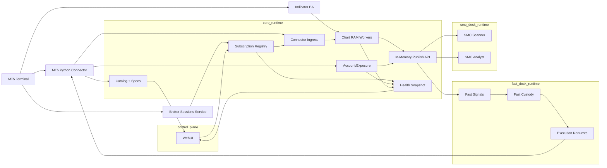
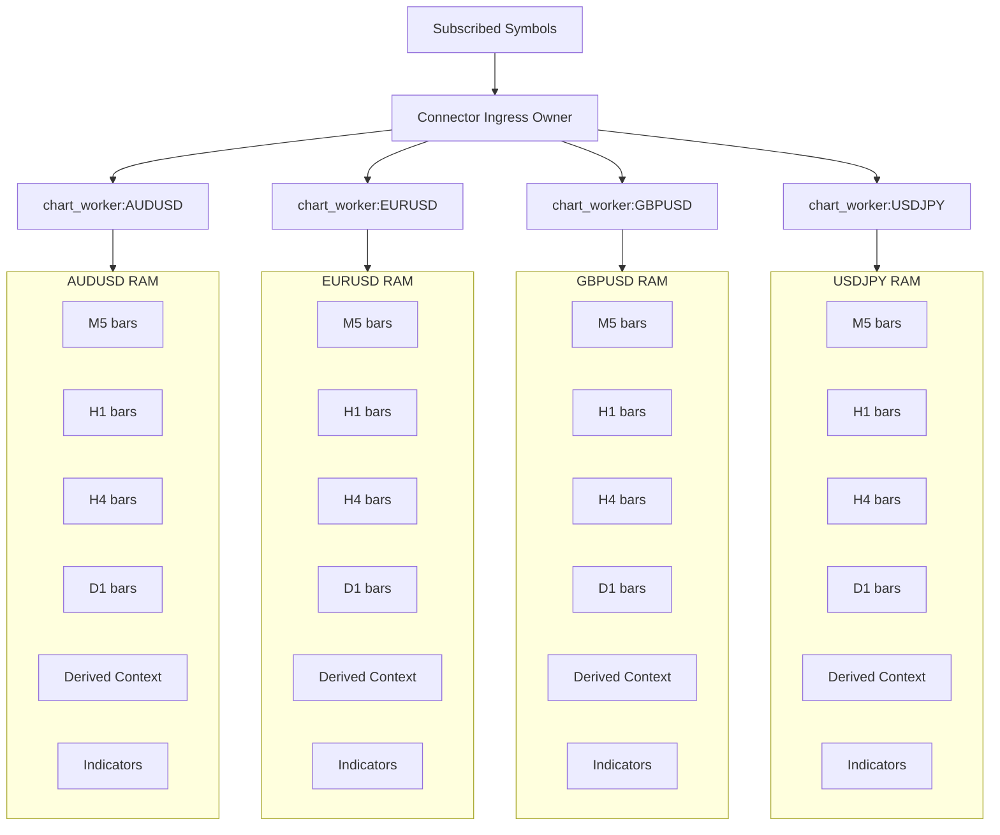
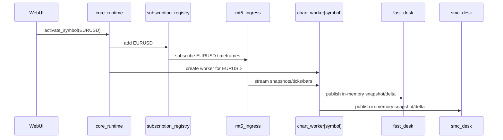

# Chart RAM Runtime Architecture

Date: 2026-03-23

## Purpose

Define the runtime architecture for the new repo so that:

- all broker-operable symbols are discovered from the MT5 connector;
- only explicitly subscribed symbols receive live dynamic updates;
- chart state lives in RAM, not in disk files;
- indicators and market sessions stay specialized and optional where appropriate;
- fast analysis and trader processes can access chart state without disk I/O in the hot path.

This document supersedes the current accidental behavior where the runtime is dynamically polling too many symbols and publishing too much live state to file/SQLite.

## Verified Current Behavior

The current implementation does **not** match the intended policy.

### What is correct today

- The system correctly loads the full broker catalog from the connector.
- The chart virtual state does exist in RAM inside `MarketStateService`.
- Sessions are coming from the MQL5 broker sessions service.
- Indicator snapshots can be imported separately.

### What is wrong today

- `active_universe` is being derived from all `visible/selected` symbols in the broker catalog.
- Dynamic market polling is running for too many symbols.
- Dynamic market state is being persisted too aggressively to SQLite and exposed in a large live JSON.
- The live file is acting as a runtime transport, when it should only be a control-plane heartbeat/status artifact.

## Key Architectural Decision

The system must separate **catalog knowledge** from **live subscription**.

These are not the same thing.

### 1. Broker Catalog Universe

All operable symbols available in the connected account/broker.

Source:

- MT5 connector

Purpose:

- WebUI listing
- symbol search
- symbol specifications
- eligibility checks

This is mostly static/slower-changing data.

### 2. Bootstrap Universe

The symbols configured for initial startup.

Initial source:

- `.env`

Future source:

- `.env` until overridden by WebUI

Purpose:

- initial chart-ram preload
- initial indicator/session registration

### 3. Subscribed Live Universe

The symbols that should receive live dynamic updates right now.

Initial source:

- `.env`

Future source:

- WebUI activation/deactivation

Purpose:

- live chart maintenance
- live indicator refresh
- session-aware polling
- fast desk subscription
- SMC desk subscription

This is the only universe that should generate hot-path dynamic load.

## Hard Rule

The connector must know the full catalog.

But it must only poll live dynamic data for the `subscribed live universe`.

That means:

- all broker symbols: yes for catalog/specs
- only subscribed symbols: yes for live OHLC/ticks/indicators/session use
- non-subscribed symbols: no dynamic polling

## Source Ownership

### MT5 Python Connector

Owner of:

- broker identity
- account identity
- full symbol catalog
- symbol specifications
- live OHLC/ticks for subscribed symbols
- account state
- positions/orders/exposure
- execution

### Broker Sessions Service

Owner of:

- trade sessions by symbol
- quote sessions by symbol
- open/closed authority

### Indicator EA

Owner of:

- MT5-native indicators for subscribed symbols/timeframes

### Chart RAM

Owner of:

- in-process runtime memory

Not:

- JSON files
- SQLite
- persisted transport blobs

## Runtime Model

### Strong recommendation

Do **not** let every symbol thread call the MT5 connector directly.

Reason:

- the MT5 Python API should have a single owner;
- direct concurrent connector calls per symbol increase complexity and risk;
- the correct design is a single ingress owner that fans out updates to symbol workers.

### Correct model

- one connector owner
- one subscription registry
- one symbol chart worker per subscribed symbol
- one optional indicator worker per subscribed symbol/timeframe
- one session registry
- desks consume RAM snapshots or in-memory IPC views

## Process / Task Separation

### Recommended V1

Keep the hot path in a small number of processes.

#### Process 1: `core_runtime`

Responsibilities:

- connector lifecycle
- broker catalog/specs
- subscription registry
- chart-ram
- indicator imports
- broker session integration
- account/exposure updates
- in-memory publish API for other processes

#### Process 2: `fast_desk_runtime`

Responsibilities:

- subscribe to active symbols
- consume in-memory chart snapshots or deltas
- run deterministic heuristics
- custody and execution logic

#### Process 3: `smc_desk_runtime`

Responsibilities:

- consume subscribed charts
- run slow heuristic + optional multimodal analysis

#### Process 4: `control_plane`

Responsibilities:

- WebUI
- activate/deactivate symbols
- inspect health
- visualize status

## In-Process Structure of `core_runtime`

Inside `core_runtime`, use symbol workers or symbol tasks.

### Recommended split

- one `connector_ingress` task/thread
- one `subscription_manager`
- one `chart_worker[symbol]` per subscribed symbol
- one `indicator_router`
- one `session_router`
- one `account_state_worker`
- one `spec/catalog worker`
- one `control-plane snapshot publisher`

### Important nuance

`chart_worker[symbol]` may be:

- an `asyncio` task
- a dedicated thread
- an actor-like loop

It does **not** need to own MT5 API access.

It needs to own symbol-local state and receive updates from the ingress owner.

## Chart RAM Model

Each subscribed symbol must own its own RAM chart state.

### Per symbol

- `M5`
- `H1`
- `H4`
- `D1`

Each timeframe keeps the configured amount of bars in memory.

### Contract

For each `(symbol, timeframe)`:

- rolling candle buffer
- last tick/bid/ask
- feed timestamps
- derived chart context
- indicator enrichment if present
- session gate state

### Storage

This must live in RAM only.

Examples:

- ring buffer
- deque
- symbol-local state object

## Persistence Policy

### SQLite should persist

- broker identity snapshots
- symbol catalog
- symbol specifications
- account state
- positions/orders
- exposure state
- execution events
- optional operational checkpoints

### SQLite should not be the hot-path transport for

- live OHLC updates every cycle
- full chart state
- every live price change
- every symbol/timeframe feed row as the main runtime bus

### Live JSON should persist only

- runtime health
- process status
- counts
- heartbeat timestamps
- active subscriptions
- service health

Not:

- full chart transport
- large dynamic feed dumps for all subscribed symbols

## Subscription Policy

### Startup

1. connector loads full operable catalog
2. runtime loads symbol specs lazily or in background
3. `.env` defines initial `bootstrap universe`
4. the runtime creates live subscriptions only for those symbols
5. chart workers are created only for those symbols

### Future with WebUI

1. operator sees full broker catalog
2. operator enables/disables symbols
3. subscription registry updates
4. `core_runtime` spawns/stops symbol chart workers accordingly
5. desks automatically gain/lose access to those symbols

## IPC Strategy

If desks are separate processes, they need chart access without disk I/O.

### Recommended V1 IPC

Use local in-memory transport semantics over process boundaries:

- local TCP
- local WebSocket
- local Unix/Named Pipe equivalent when desired
- compact JSON or msgpack snapshots/deltas

### Recommended read pattern

- `core_runtime` is the sole writer of live chart state
- other processes are subscribers/readers
- desks never write chart state

This gives:

- one source of truth
- no file polling
- no SQLite as live transport

## Recommended Universe Objects

The runtime should explicitly track:

- `catalog_universe`
- `bootstrap_universe`
- `subscribed_universe`
- `active_chart_workers`

These should be separate objects, not one overloaded `active_universe`.

## Mermaid: High-Level Runtime



## Mermaid: Symbol-Scoped Chart RAM



## Mermaid: Activation Lifecycle



## Immediate Corrections Needed In Code

### 1. Split universes

Replace the current single `active_universe` logic with:

- catalog universe
- bootstrap universe
- subscribed universe

### 2. Restrict dynamic polling

Only `subscribed_universe` should be polled for:

- snapshots
- indicators
- session-aware live updates

### 3. Remove live market-state transport from disk path

Reduce `core_runtime.json` to control-plane health/status only.

### 4. Keep chart state in RAM only

Do not use JSON or SQLite as the primary live-chart transport.

### 5. Expose RAM chart access through IPC

Desks must consume RAM-backed data through:

- same-process access
- or local IPC publish/subscribe

## Decision

The intended architecture is:

- full broker catalog from connector
- initial live symbol set from `.env`
- future live symbol activation from WebUI
- chart workers only for subscribed symbols
- chart state only in RAM
- SQLite only for operational persistence
- live JSON only for health/control-plane visibility
- connector single-owner ingress, not many symbol threads calling MT5 directly

---

## RESTRICCIONES OBLIGATORIAS — Correcciones del audit 2026-03-23

Las siguientes restricciones reemplazan y anulan cualquier comportamiento anterior contrario.

### "live JSON only for health" fue violado — corrección definitiva

El punto anterior sobre "live JSON only for health/control-plane visibility" fue **incorrectamente implementado** como un archivo `core_runtime.json` de ~800 líneas escrito cada segundo con bid/ask de todos los símbolos suscritos.

**Corrección definitiva:**

- `storage/live/core_runtime.json` **no debe existir**
- `storage/live/` **no debe existir**
- El runtime no escribe ningún archivo JSON durante la operación normal
- El único canal de visibilidad de estado es el **Control Plane HTTP** (`FastAPI`, `0.0.0.0:8765`)

### Datos prohibidos en disco

| Dato | Motivo |
|---|---|
| `bid` / `ask` en cualquier archivo | Volátil, sin valor persisted |
| `tick_age_seconds` en cualquier archivo | Volátil |
| `bar_age_seconds` en cualquier archivo | Volátil |
| `feed_status` en cualquier archivo | Volátil |
| Snapshots de indicadores en `storage/indicator_snapshots/` | `IndicatorBridge` aplica en RAM, no copia al disco |

### Aclaración sobre "SQLite for operational checkpoints"

`market_state_cache` puede persitir la estructura de velas (símbolo, timeframe, last_bar_timestamp, bar_count). **No puede** contener:

```sql
-- PROHIBIDO en market_state_cache
bid REAL,
ask REAL,
last_price REAL,
tick_age_seconds REAL,
bar_age_seconds REAL,
feed_status TEXT,
```

### Acceso a estado live: solo por Control Plane HTTP

El diagrama Mermaid superior muestra `IPC → WebUI` y `HEALTH → WEB`. En la implementación correcta:

- `HEALTH` es el Control Plane HTTP (`/status`, `/chart/{symbol}/{tf}`, `/positions`, etc.)
- No hay archivo en disco como intermediario
- No hay polling de JSON desde los desks
- Los desks acceden al chart RAM por referencia directa (mismo proceso) o por Control Plane HTTP (proceso separado)
